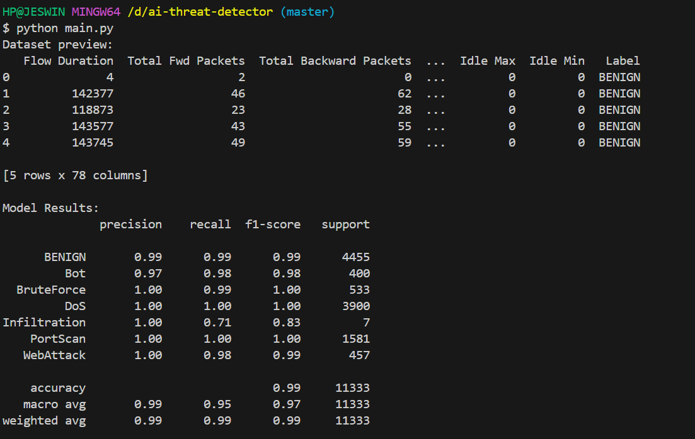

# 🔐 AI Cybersecurity Threat Detector

This project uses machine learning to detect malicious network traffic using the [CICIDS2017 dataset](https://www.unb.ca/cic/datasets/ids-2017.html). It's a beginner-friendly implementation using Python, pandas, and a Random Forest classifier.

## 🧠 Features

- Detects malicious vs normal traffic
- Based on open-source network security dataset
- Beginner-friendly ML implementation
- Easily extendable to deep learning or real-time use

## 🚀 How to Run

1. Clone the repository
2. Install dependencies:

    ```bash
    pip install pandas scikit-learn matplotlib
    ```

3. Run the project:

    ```bash
    python main.py
    ```

## 📁 Dataset

Sample CSV used: [Download Sample CSV]

> ⚠️ For full datasets, download from: [CICIDS2017 Official Page](https://www.unb.ca/cic/datasets/ids-2017.html)

## 🧩 Tech Stack

- **Language**: Python
- **ML Library**: scikit-learn
- **Data Handling**: pandas
- **Model**: Random Forest Classifier

## 📸 Screenshots




